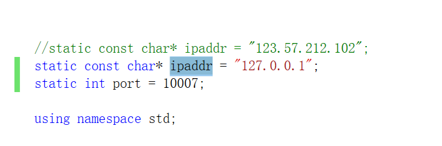
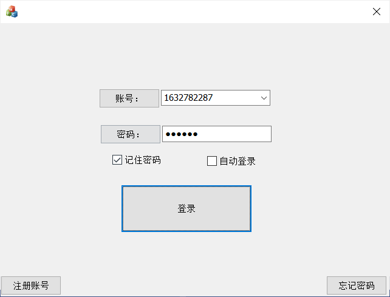
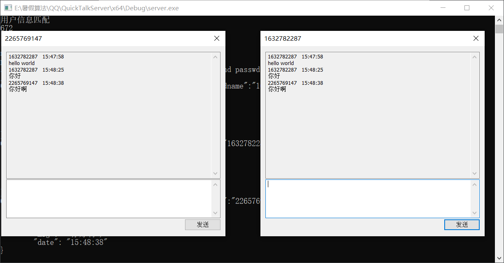

## QuickTalkClient

## 简介

这是一个简单的快速聊天的客户端程序,  使用MFC框架编写,  注册登录后, 选定用户后即可快速聊天

## 使用

### 启动服务器程序

找到QuickTalkSever([项目地址](https://github.com/djmnb/QuickTalkServer)) 按照步骤并启动

### 修改服务器ip和端口

在这里指定QuickTalkServer服务器所在的ip和端口(在Test1.h里面)

### 使用vs2019编译程序

## 展示

### 登录页面

### 聊天页面

